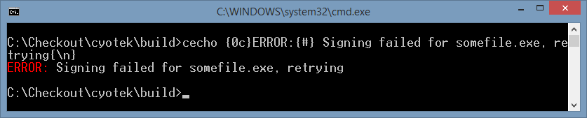
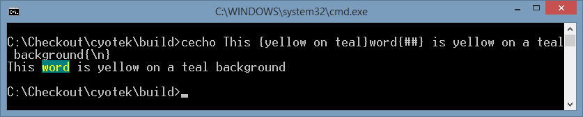
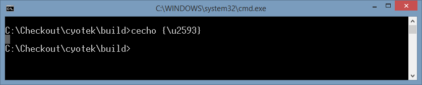

ColorEcho - printing coloured text from batch files
===================================================

For some time now, I've been using `cecho.exe` from a [CodeProject article](http://www.codeproject.com/Articles/17033/Add-Colors-to-Batch-Files) so that I highlight errors and successes in my batch files. And this has worked fine - as long as I was running the files in a console window.

However, for whatever reason, if you call `cecho` from a batch file that is being run through Visual Studio, or a build process such as Jenkins or TeamCity, nothing would be output.

I had observed that my own console tools which used coloured output appeared perfectly well in all three cases above so I decided I would replicate the `cecho.exe` tool using C#.

## Using the tool

As I'm not in a hurry to change all the batch files calling `cecho` I've kept the exact same syntax (and for the time being the same annoying behaviour regarding having to manually reset colours and include line breaks).

* `{XX}`: colours coded as two hexadecimal digits. E.g., `{0A}` light green
* `{color}`: colour information as understandable text. E.g., `{light red on black}`
* `{\n}`: New line character
* `{\t}`: Tab character
* `{\u0000}`: Unicode character code
* `{{`: escape character `{`
* `{#}`: restore foreground colour
* `{##}`: restore foreground and background colour

Colours are defined as

* `0`: Black (`black`)
* `1`: Dark Blue (`navy`, `dark blue`)
* `2`: Dark Green (`green`, `dark green`)
* `3`: Dark Cyan (`teal`, `dark cyan`)
* `4`: Dark Red (`maroon`, `dark red`)
* `5`: Dark Magenta (`purple`, `dark magenta`)
* `6`: Dark Yellow (`olive`, `brown`, `dark yellow`)
* `7`: Gray (`silver`, `light gray`, `light grey`)
* `8`: Dark Gray (`gray`, `grey`, `dark gray`, `dark grey`)
* `9`: Blue (`blue`, `light blue`)
* `A`: Green (`lime`, `light green`)
* `B`: Cyan (`aqua`, `light cyan`)
* `C`: Red (`red`, `light red`)
* `D`: Magenta (`fuschia`, `magenta`, `light magenta`)
* `E`: Yellow (`yellow`)
* `F`: White (`white`)

The names in brackets are alternatives you can use for understandable text.

## Note

For backwards compatibility, this program behaves the same way as the original `cecho` - lines are not terminated with a carriage return and the colours are not reset. Therefore you should ensure you include `{#}` or `{##}` and `{\n}` at the end of your statements.

Or of course, just modify the source to do this automatically if you don't need compatibility.

## Samples

This first example uses the shorthand notation to change `ERROR:` into red.

<pre>cecho {0c}ERROR:{#} Signing failed for program1.exe, retrying{\n}</pre>

This example uses named colours instead of hex codes.

<pre>cecho This {yellow on teal}word{##} is yellow on a teal background{\n}</pre>

This final example prints out an extended character.

<pre>cecho {\u2593}</pre>

